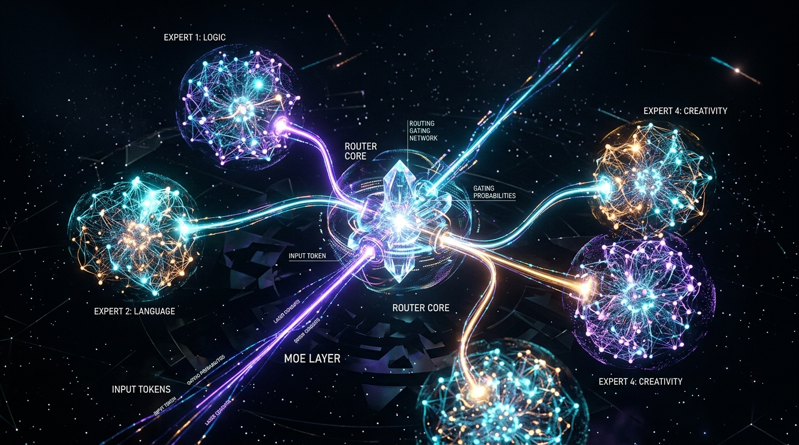

# 🧠 3D Mixture of Experts (MoE) Architecture Visualizer

An interactive, visually stunning 3D simulation illustrating how **Mixture of Experts (MoE)** operates at the neural network level inside modern Large Language Models (such as Mixtral 8x7B, Gemini 1.5/2.0, DeepSeek-V3).



---

## ✨ Features

- **Neural Network Level Visualization**:
  - **Input Embedding Port**: Stream of dimensional token vectors ($x \in \mathbb{R}^{d_{model}}$).
  - **The Gating / Router Network ($W_g$)**: Rotating icosahedral core computing dynamic routing logits and Top-K sparse selection.
  - **Real-Time Softmax Radar**: Holographic radar disk projecting routing probabilities ($\alpha_0 \dots \alpha_7$).
  - **8 Floating Neural MLP Experts**:
    - **Layer 1**: Gate / Up-projection ($d_{model} = 4096$)
    - **Layer 2**: SwiGLU activation core ($d_{ffn} = 14336$) with spinning activation tori
    - **Layer 3**: Down-projection ($d_{model} = 4096$)
    - **Synaptic Waves**: Bioluminescent action potential wave propagation across active neurons.
  - **Sparse Gating in Action**: Active Top-K experts ignite with neon energy, while unselected experts remain in a low-power, dim idle state (0 active FLOPs).
  - **Weighted Aggregator**: Computes $y = \sum_{i \in \text{TopK}} \alpha_i E_i(x)$ with energy beams scaled by routing weight.
  - **Residual Skip Connection**: Glowing fiber-optic bypass conduit merging $x + \text{MoE}(x)$.

- **Interactivity & Controls**:
  - **Preset Prompt Chips**: Instant testing with `💻 Python Code`, `📐 Maxwell's Equations`, `📜 Poetic Prose`, `🌍 Multilingual`, and `🧠 Modus Tollens`.
  - **Custom Token Injector**: Type any custom phrase or code to watch dynamic semantic routing.
  - **Sparsity Switcher**: Toggle between `Top-1`, `Top-2` (default), `Top-4`, and `Dense (All 8)` to compare compute efficiency and FLOPs savings.
  - **Camera Modes**: Animated transitions for `Overview`, `Router Core`, `Neural MLP`, `Aggregator`, and `Cinematic Orbit` + 360° free orbit/zoom.
  - **Click-to-Inspect**: Click any 3D expert cluster to focus on its internal neural MLP lattice.
  - **Web Audio Ambient Synthesizer**: Subtle synthesized ambient drone and neural routing pulses.

---

## 🚀 Quick Start

No build step or external dependencies required. Simply serve the directory with any local HTTP server:

```bash
# Using Python
python -m http.server 8080

# Or using Node
npx serve .
```

Open [http://localhost:8080](http://localhost:8080) in any modern web browser.

---

## 🛠️ Tech Stack

- **Core**: Vanilla HTML5, CSS3, JavaScript (ES Modules).
- **3D Graphics**: Three.js (v0.160.0), `OrbitControls`, `EffectComposer`, `UnrealBloomPass`.
- **Audio**: Web Audio API (procedural synthesizer, zero audio files).
- **Styling**: Obsidian glassmorphism with backdrop filters and glowing cyber-neural accents.

---

## 📄 License

MIT License. Feel free to use, modify, and learn from this visualization!
